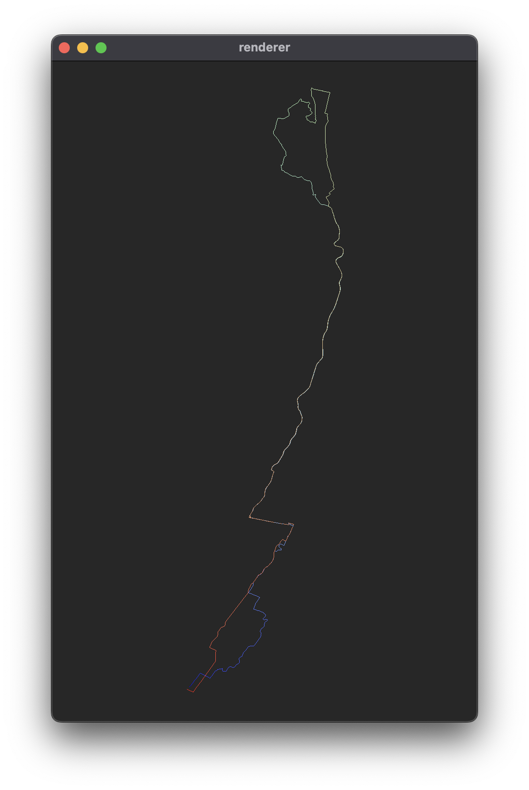
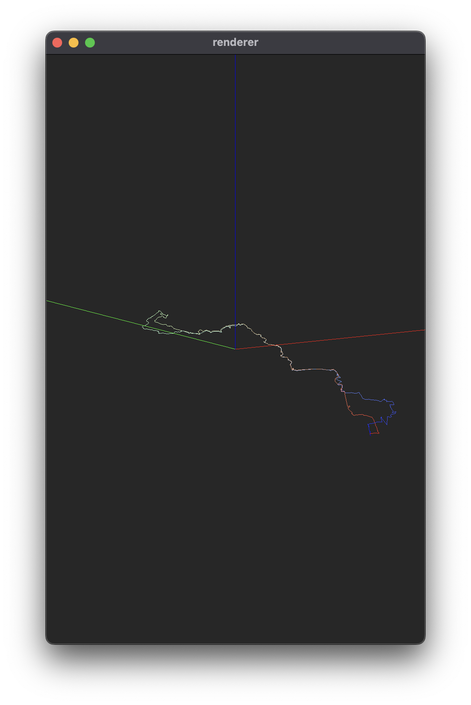
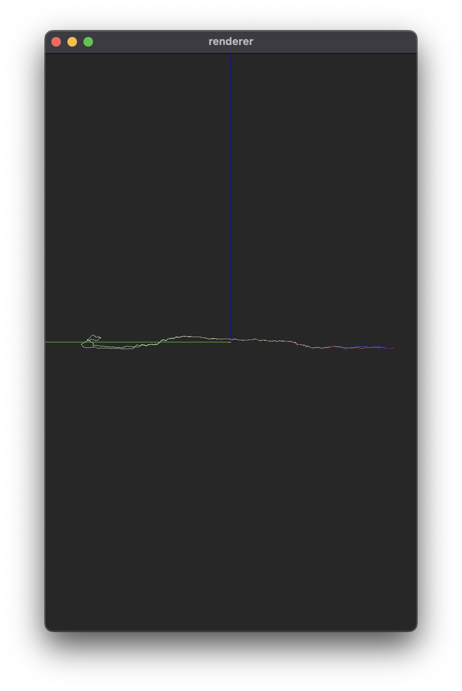

# Mycelium

A 3D renderer that visualizes GPS activity data as an interconnected network. Like mycelium spreading underground, this project maps how routes accumulate over time to trace out the physical world.

<p align="center">
  
  
  
</p>
<p align="center"><em>A scene showing the standard 9W route: top-down view, terrain perspective, and elevation profile</em></p>

<br>
<br>

The goal is to map New York City through accumulated GPS data: streets by cycling and running, the subway system by commuting, and building interiors by climbing every flight of stairs. Since mapping an entire city by myself would take years, the project uses DataFusion for data storage, allowing multiple contributors to build the map together.

Data is collected from Garmin watches and bike computers, though any device that exports FIT files works (Wahoo, etc.). The included Python scripts can download activities directly from Garmin Connect.

## Usage

### Running the Renderer

```sh
cargo run

# with debug logging
RUST_LOG=debug cargo run
```

### Downloading Data from Garmin Connect

```sh
# install dependencies
uv sync

# configure Garmin credentials
cp .env.example .env
# edit .env with your credentials

# download activities
uv run download.py                                           # last 7 days (default)
uv run download.py --start-date 2025-01-01 --end-date 2025-01-31
```

## Renderer Features

The renderer uses a WebGPU-based pipeline to visualize GPS tracks in real-time, with routes color-coded to show activity progression and full altitude data support.

Camera controls include two view presets: press `1` for a top-down 2D map perspective, or `2` for a 45° 3D terrain view. Press `0` to toggle debug axes. Navigation works through left-click dragging to orbit, right-click dragging to pan, and scroll wheel to zoom. You can also fly through the scene with `W`/`S` (forward/backward) and `A`/`D` (left/right), or use arrow keys for panning.

Note, a lot of these features are super jank (for now)

## Reading

### WGPU

https://shi-yan.github.io/webgpuunleashed/<br>
https://sotrh.github.io/learn-wgpu/beginner/tutorial6-uniforms/#a-perspective-camera<br>

### Quaternions

https://www.youtube.com/watch?v=zjMuIxRvygQ<br>
https://en.wikipedia.org/wiki/Quaternions_and_spatial_rotation<br>
